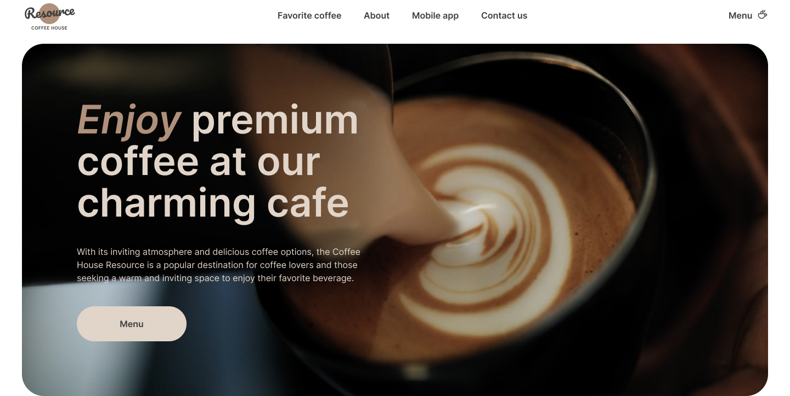

# Coffee House 

Coffee House is designed to showcase the variety and atmosphere of your coffee shop. Here, you can browse the menu, selecting sizes and ingredients, and find out the total cost of your order.

## Technologies

- HTML5
- CSS3
- JavaScript (ES6+)
- Swiper

## Layout

- Fixed layout in pixels (px).
- Semantic and valid structure.
- Responsive and cross-browser compatible design. The website is adapted for extensions 380px, 768px and 1440px.

## Functionality

Header

- Header includes logo and navigation menu.
- Navigation menu contains links to different sections of the website.
- There is a menu button to go to another page.

Hero

- The first screen uses video.
- When you click on the button, the menu goes to the next page for product selection

Favorite coffee

- Slider with different images implemented using Swiper.
- Images fade in for a pleasing effect.

About

- This section tells about the values, comfort and features of the Coffee House.
- Photo gallery of happy people.

Mobile app

- Mobile App indicates the availability of a mobile application for convenient drink ordering and access.

Contact us

- The contact details of the coffee house are indicated.

Menu

- The full menu is available.
- Filter by product type.
- Quick and easy product design.

## Contribution

If you have ideas for improving this website, you can create a pull request or open an issue in [repository](https://github.com/Ira-Bughaichuk/coffee) 

You are free to use, modify and distribute this website.

Thank you for using the Coffee House!
